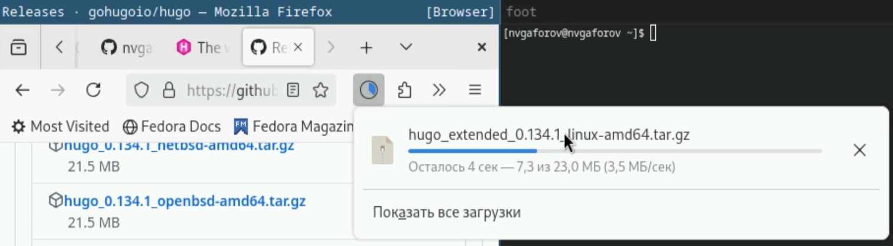
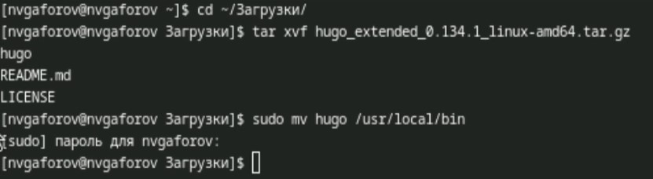
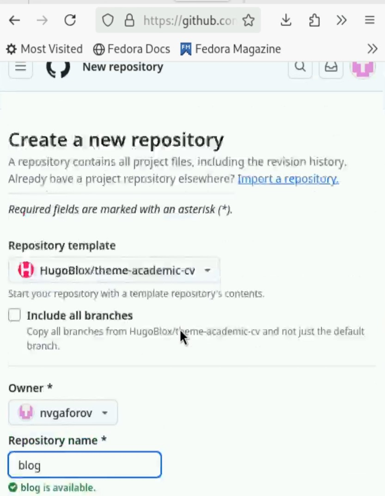
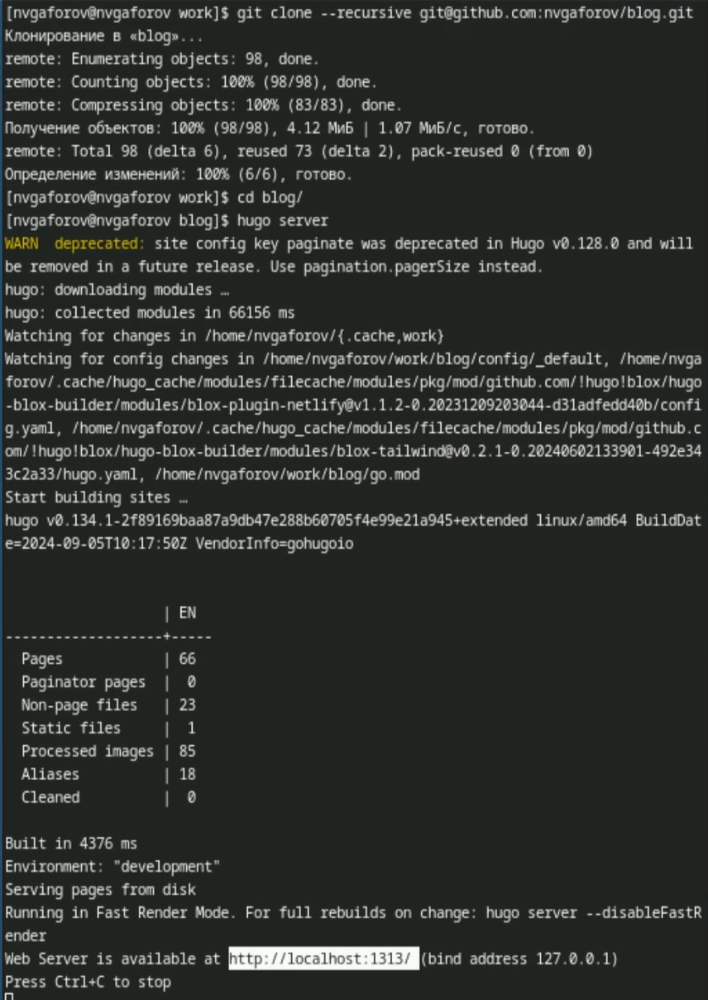
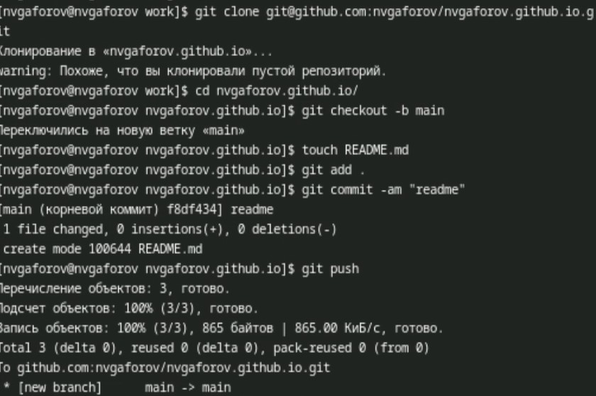
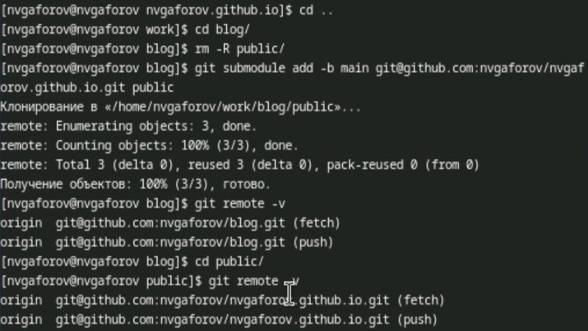
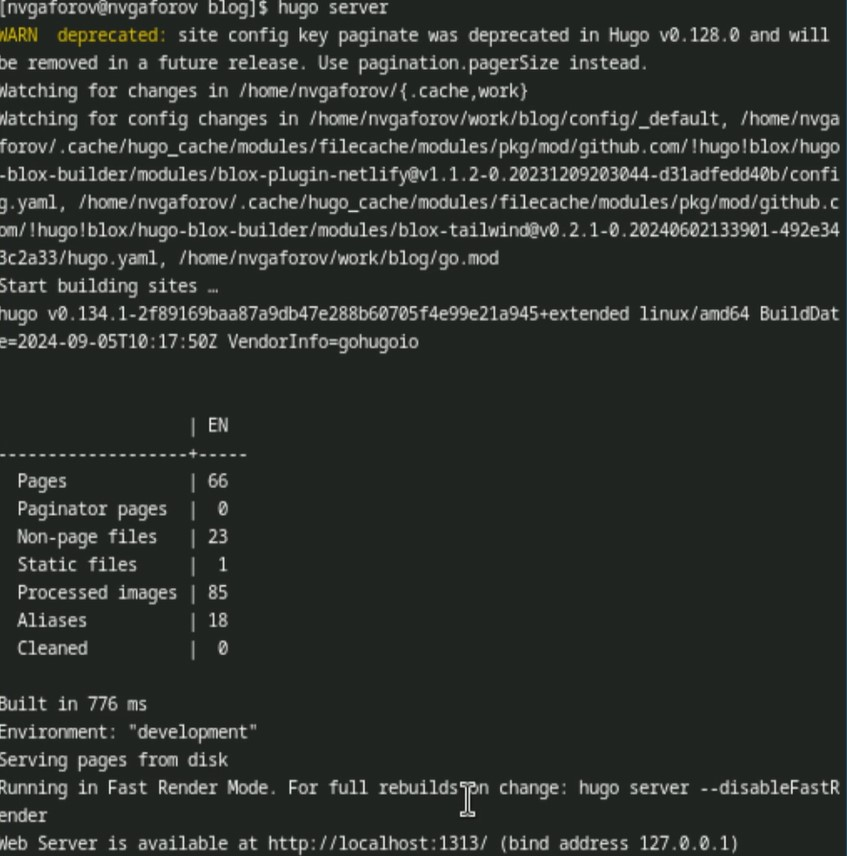
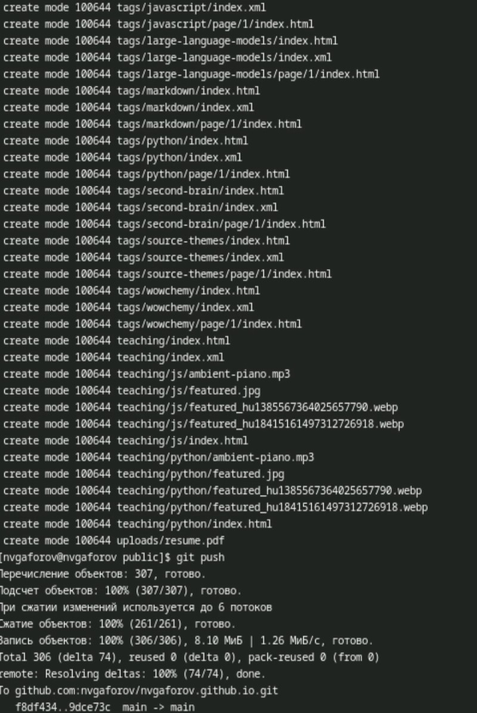

---
## Front matter
lang: ru-RU
title: Индивидуальный проект
subtitle: Этап 1
author:
  - Гафоров Н. В.
institute:
  - Российский университет дружбы народов, Москва, Россия
date: 01 января 1970

## i18n babel
babel-lang: russian
babel-otherlangs: english

## Formatting pdf
toc: false
toc-title: Содержание
slide_level: 2
aspectratio: 169
section-titles: true
theme: metropolis
header-includes:
 - \metroset{progressbar=frametitle,sectionpage=progressbar,numbering=fraction}
 - '\makeatletter'
 - '\beamer@ignorenonframefalse'
 - '\makeatother'

## Fonts
mainfont: PT Serif
romanfont: PT Serif
sansfont: PT Sans
monofont: PT Mono
mainfontoptions: Ligatures=TeX
romanfontoptions: Ligatures=TeX
sansfontoptions: Ligatures=TeX,Scale=MatchLowercase
monofontoptions: Scale=MatchLowercase,Scale=0.9
---

# Информация

## Докладчик

:::::::::::::: {.columns align=center}
::: {.column width="70%"}

  * Гафоров Нурмухаммад Вомикович
  * Студент
  * Российский университет дружбы народов

:::
::: {.column width="30%"}

:::
::::::::::::::

## Цель работы

Сделать сайт на конструкторе Hugo

## Задачи

Установить необходимое программное обеспечение.  
Скачать шаблон темы сайта.  
Разместить его на хостинге git.  
Установить параметр для URLs сайта.  
Разместить заготовку сайта на Github pages.  

## Скачивание Hugo

Для начала скачаем Hugo из github

{height=40%}

## Установка Hugo

Распакуем архив и установим его, поместив в /usr/local/bin

{height=40%}

## Создание репозитория

Создадим репозиторий на основе предложенного шаблона сайта. Назовём его blog 

{height=40%}

## Запуск сайта

Теперь склонируем его на компьютер и запустим с помощью Hugo

{height=40%}

## Создание репозитория-хостинга

Создадим репозиторий, который специально предназначен для того, чтобы хостить сайт

{height=40%}

## Первоначальная настройка репозитория

Склонируем этот репозиторий, создадим в нём Readme и сделаем коммит, загрузив изменения

{height=40%}

## Настройка сабмодуля

Удалим из первого репозитория папку public, и сделаем только что созданный репозиторий как сабмодуль к данному, поместив его в public

{height=40%}

## Запуск сайта

Запустим сайт ещё раз

{height=40%}

## Выгрузка изменений

Теперь выгрузим все изменения на гитхаб

{height=40%}

## Внешний вид сайта

Так будет выглядить сайт на хосте гитхаба

{height=40%}

## Выводы

В результате работы был базово настроен сайт
