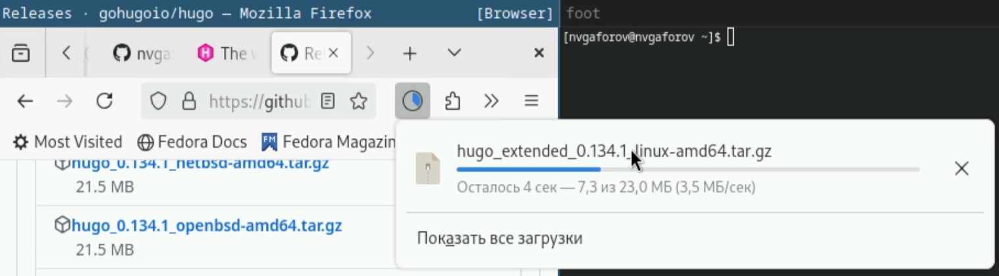
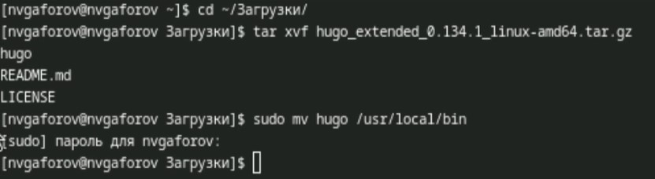
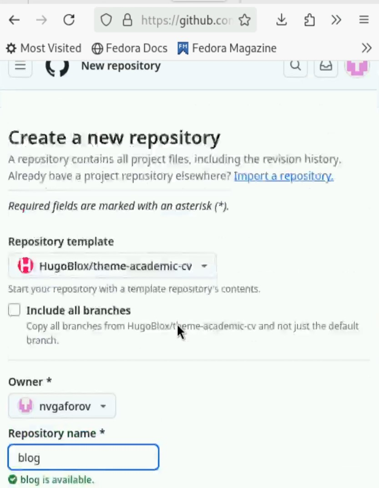
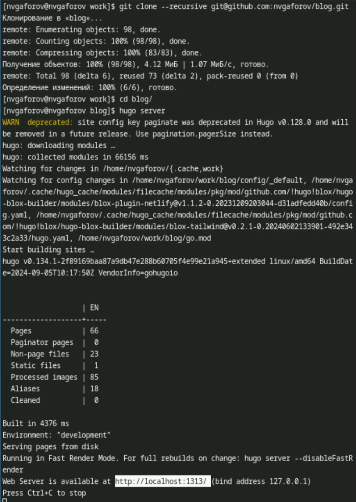
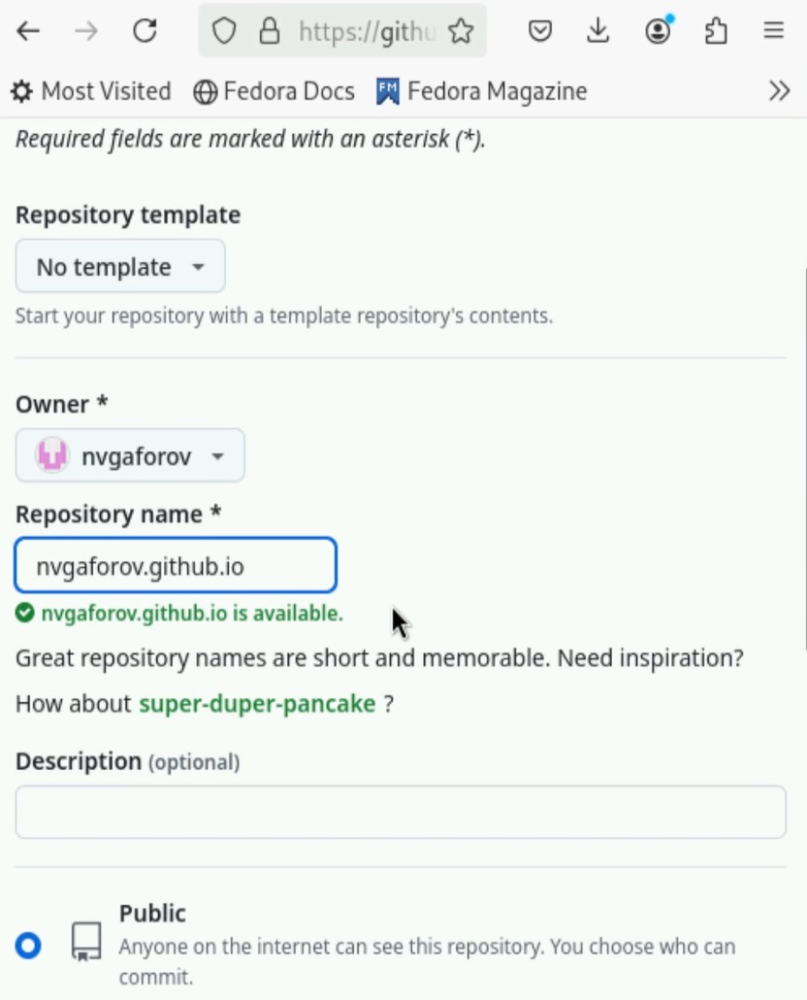
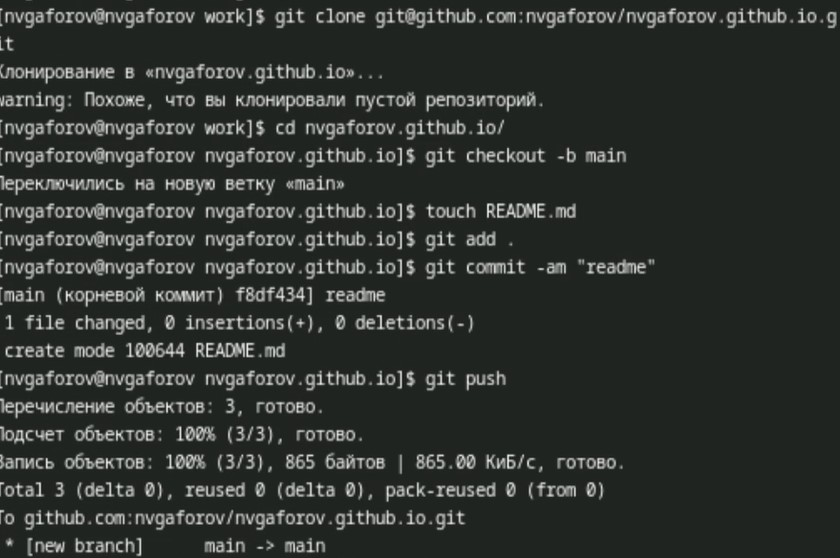
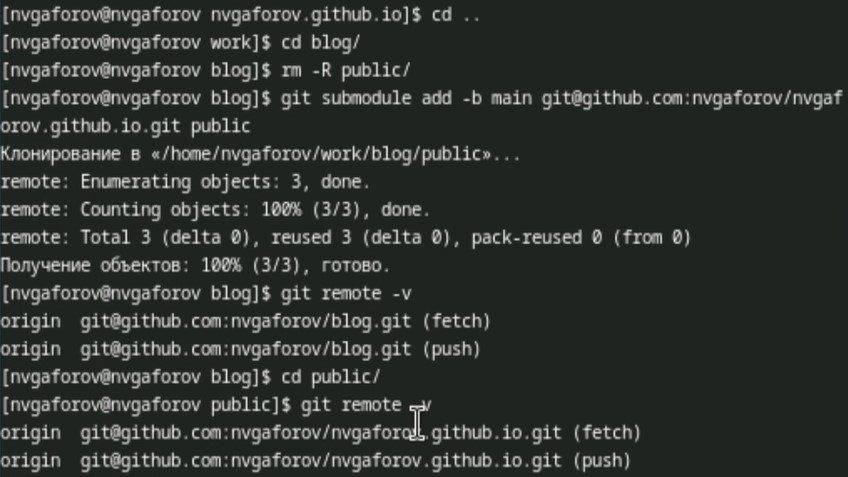
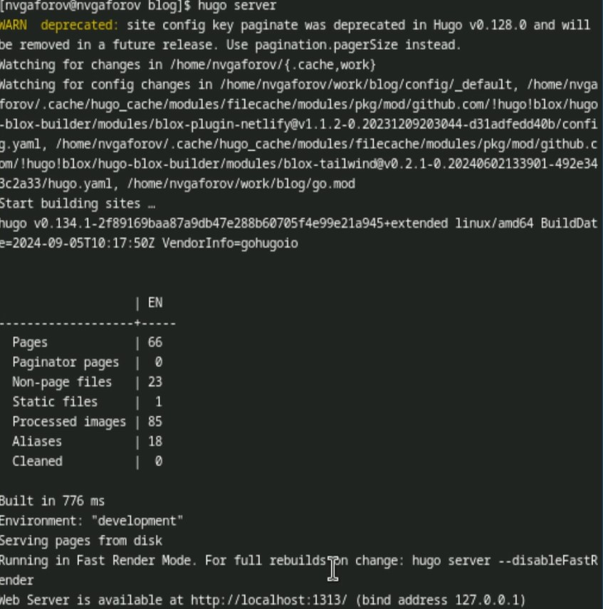
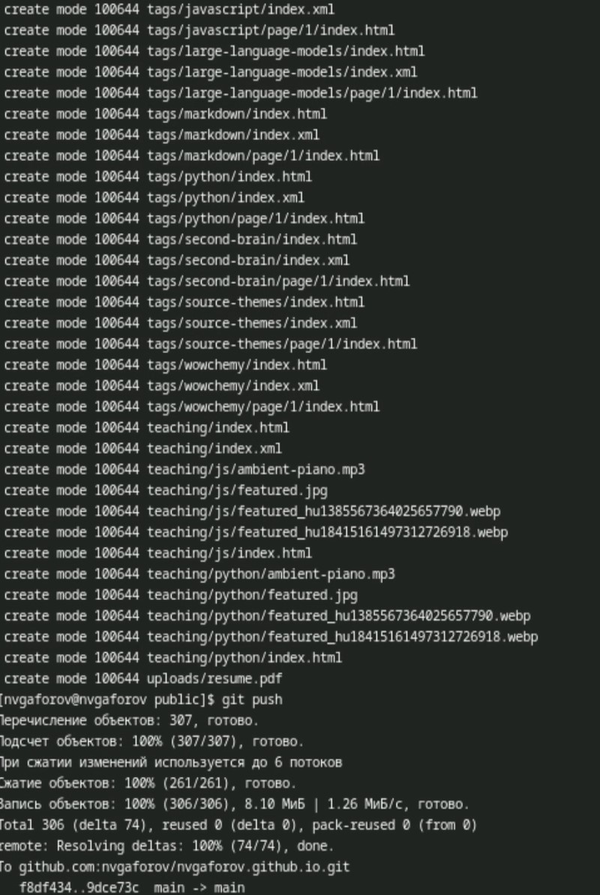

---
## Front matter
title: "Индивидуальный проект"
subtitle: "Этап 1"
author: "Гафоров Нурмухаммад Вомикович"

## Generic otions
lang: ru-RU
toc-title: "Содержание"

## Bibliography
bibliography: bib/cite.bib
csl: pandoc/csl/gost-r-7-0-5-2008-numeric.csl

## Pdf output format
toc: true # Table of contents
toc-depth: 2
lof: true # List of figures
lot: true # List of tables
fontsize: 12pt
linestretch: 1.5
papersize: a4
documentclass: scrreprt
## I18n polyglossia
polyglossia-lang:
  name: russian
  options:
	- spelling=modern
	- babelshorthands=true
polyglossia-otherlangs:
  name: english
## I18n babel
babel-lang: russian
babel-otherlangs: english
## Fonts
mainfont: PT Serif
romanfont: PT Serif
sansfont: PT Sans
monofont: PT Mono
mainfontoptions: Ligatures=TeX
romanfontoptions: Ligatures=TeX
sansfontoptions: Ligatures=TeX,Scale=MatchLowercase
monofontoptions: Scale=MatchLowercase,Scale=0.9
## Biblatex
biblatex: true
biblio-style: "gost-numeric"
biblatexoptions:
  - parentracker=true
  - backend=biber
  - hyperref=auto
  - language=auto
  - autolang=other*
  - citestyle=gost-numeric
## Pandoc-crossref LaTeX customization
figureTitle: "Рис."
tableTitle: "Таблица"
listingTitle: "Листинг"
lofTitle: "Список иллюстраций"
lotTitle: "Список таблиц"
lolTitle: "Листинги"
## Misc options
indent: true
header-includes:
  - \usepackage{indentfirst}
  - \usepackage{float} # keep figures where there are in the text
  - \floatplacement{figure}{H} # keep figures where there are in the text
---

# Цель работы

Сделать сайт на конструкторе Hugo [@github]

# Задание

Установить необходимое программное обеспечение.  
Скачать шаблон темы сайта.  
Разместить его на хостинге git.  
Установить параметр для URLs сайта.  
Разместить заготовку сайта на Github pages.  

# Выполнение лабораторной работы

Для начала скачаем Hugo из github (рис. [-@fig:001]).

{#fig:001}

Распакуем архив и установим его, поместив в /usr/local/bin (рис. [-@fig:002]).

{#fig:002}

Создадим репозиторий на основе предложенного шаблона сайта. Назовём его blog (рис. [-@fig:003]).

{#fig:003}

Теперь склонируем его на компьютер и запустим с помощью Hugo (рис. [-@fig:004]).

{#fig:004}

Создадим репозиторий, который специально предназначен для того, чтобы хостить сайт (рис. [-@fig:005]).

{#fig:005}

Склонируем этот репозиторий, создадим в нём Readme и сделаем коммит, загрузив изменения (рис. [-@fig:006]).

{#fig:006}

Удалим из первого репозитория папку public, и сделаем только что созданный репозиторий как сабмодуль к данному, поместив его в public (рис. [-@fig:007]).

{#fig:007}

Запустим сайт ещё раз (рис. [-@fig:008]).

{#fig:008}

Теперь выгрузим все изменения на гитхаб (рис. [-@fig:009]).

{#fig:009}

Так будет выглядить сайт на хосте гитхаба (рис. [-@fig:010]).

{#fig:010}

# Выводы

В результате работы был базово настроен сайт

# Список литературы{.unnumbered}

::: {#refs}
:::
