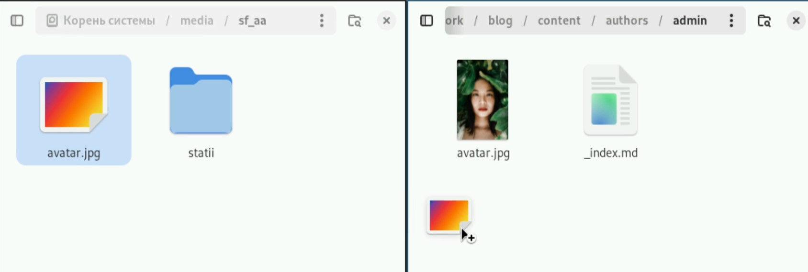
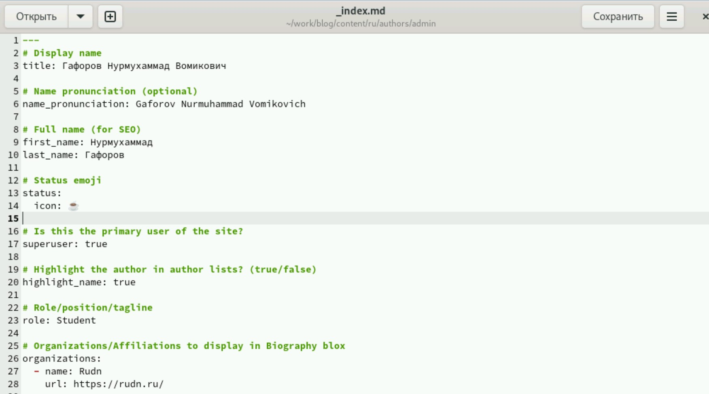
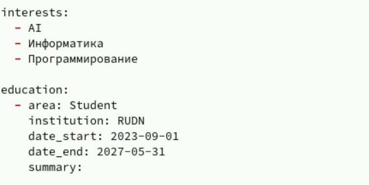
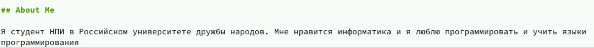
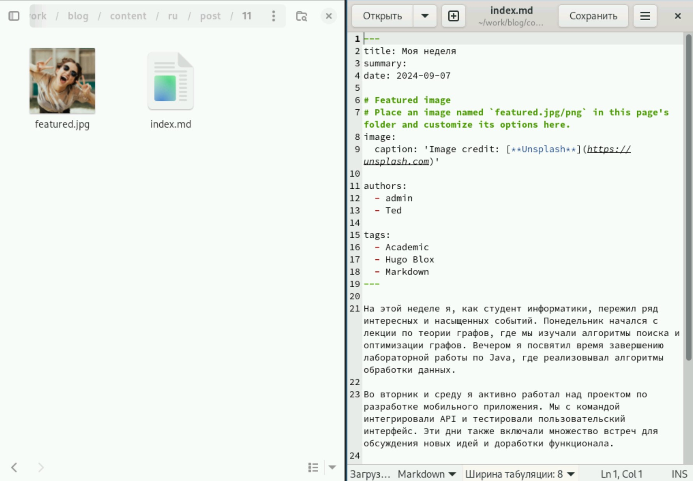
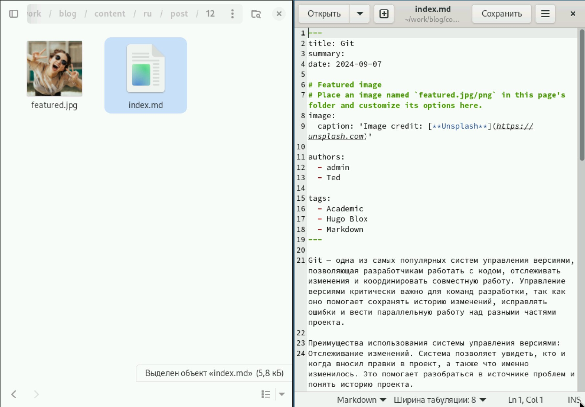

---
## Front matter
lang: ru-RU
title: Индивидуальный проект
subtitle: Этап 2
author:
  - Гафоров Н. В.
institute:
  - Российский университет дружбы народов, Москва, Россия
date: 01 января 1970

## i18n babel
babel-lang: russian
babel-otherlangs: english

## Formatting pdf
toc: false
toc-title: Содержание
slide_level: 2
aspectratio: 169
section-titles: true
theme: metropolis
header-includes:
 - \metroset{progressbar=frametitle,sectionpage=progressbar,numbering=fraction}
 - '\makeatletter'
 - '\beamer@ignorenonframefalse'
 - '\makeatother'

## Fonts
mainfont: PT Serif
romanfont: PT Serif
sansfont: PT Sans
monofont: PT Mono
mainfontoptions: Ligatures=TeX
romanfontoptions: Ligatures=TeX
sansfontoptions: Ligatures=TeX,Scale=MatchLowercase
monofontoptions: Scale=MatchLowercase,Scale=0.9
---

# Информация

## Докладчик

:::::::::::::: {.columns align=center}
::: {.column width="70%"}

  * Гафоров Нурмухаммад Вомикович
  * Студент
  * Российский университет дружбы народов

:::
::: {.column width="30%"}

:::
::::::::::::::

## Цель работы

Сделать сайт на конструкторе Hugo

## Задачи

Разместить фотографию владельца сайта.  
Разместить краткое описание владельца сайта (Biography).  
Добавить информацию об интересах (Interests).  
Добавить информацию от образовании (Education).  
Сделать пост по прошедшей неделе.  
Добавить пост на тему по выбору  

## Установка собственного аватара

Поставим собственный аватар по адресу blog/content/authors/admin 

{height=40%}

## Редактирование файла _index.md

Откроем файл рядом с аватаркой, и зименим имя, а также укажем организацию 

{height=40%}

## Указание интересов и образования

Укажем интересы и образование 

{height=40%}

## Биография

И добавим в конце немного биографии

{height=40%}

## Пост о моей неделе

Напишем пост о прошедшей неделе 

{height=40%}

## Пост про гит

И напишем про Гит

{height=40%}

## Выводы

В результате работы был отредактирован сайт, и теперь часть данных соответствует мне
