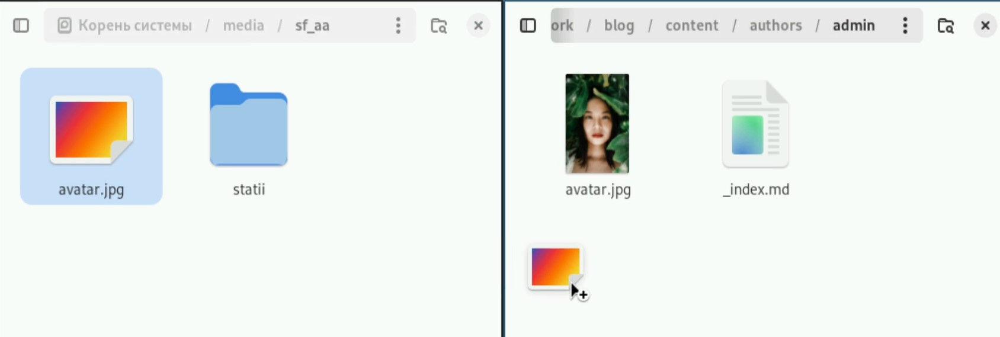
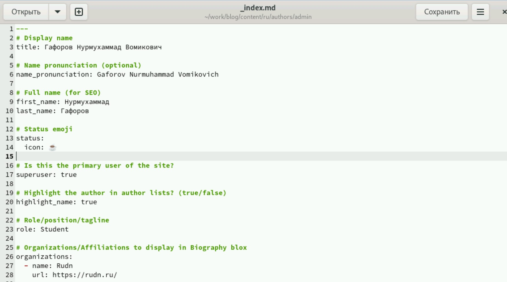
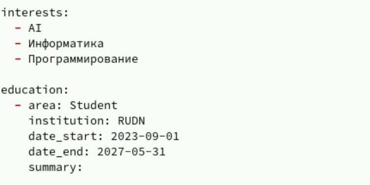
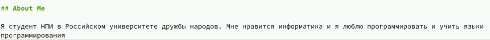
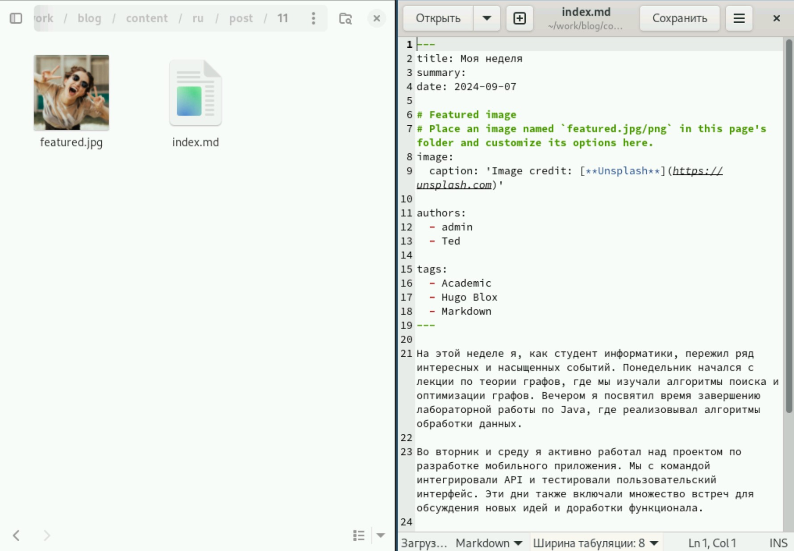
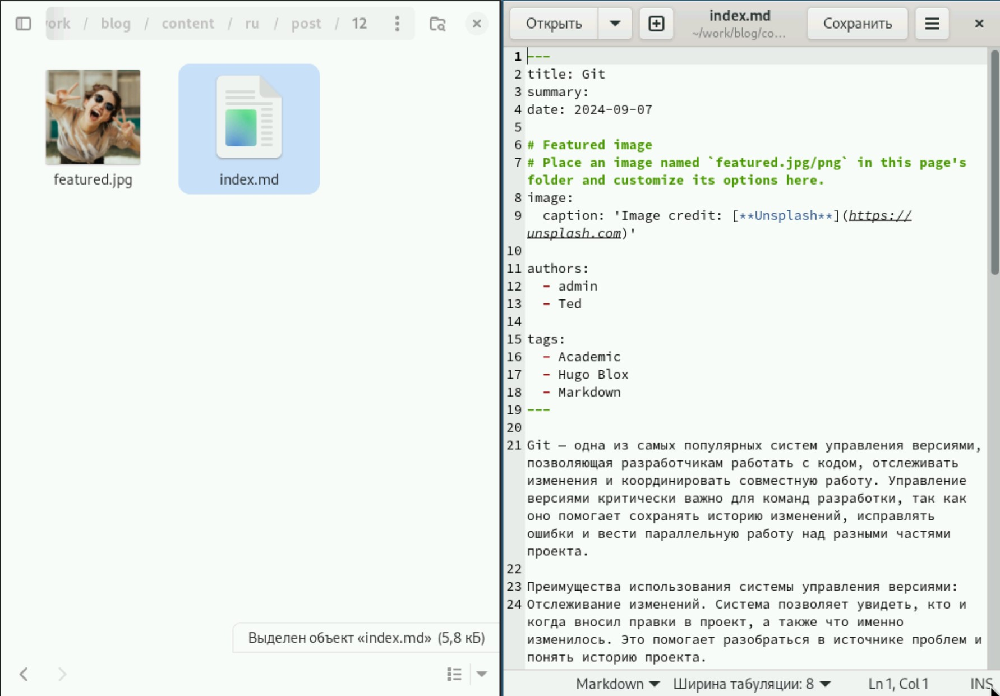

---
## Front matter
title: "Индивидуальный проект"
subtitle: "Этап 2"
author: "Гафоров Нурмухаммад Вомикович"

## Generic otions
lang: ru-RU
toc-title: "Содержание"

## Bibliography
bibliography: bib/cite.bib
csl: pandoc/csl/gost-r-7-0-5-2008-numeric.csl

## Pdf output format
toc: true # Table of contents
toc-depth: 2
lof: true # List of figures
lot: true # List of tables
fontsize: 12pt
linestretch: 1.5
papersize: a4
documentclass: scrreprt
## I18n polyglossia
polyglossia-lang:
  name: russian
  options:
	- spelling=modern
	- babelshorthands=true
polyglossia-otherlangs:
  name: english
## I18n babel
babel-lang: russian
babel-otherlangs: english
## Fonts
mainfont: PT Serif
romanfont: PT Serif
sansfont: PT Sans
monofont: PT Mono
mainfontoptions: Ligatures=TeX
romanfontoptions: Ligatures=TeX
sansfontoptions: Ligatures=TeX,Scale=MatchLowercase
monofontoptions: Scale=MatchLowercase,Scale=0.9
## Biblatex
biblatex: true
biblio-style: "gost-numeric"
biblatexoptions:
  - parentracker=true
  - backend=biber
  - hyperref=auto
  - language=auto
  - autolang=other*
  - citestyle=gost-numeric
## Pandoc-crossref LaTeX customization
figureTitle: "Рис."
tableTitle: "Таблица"
listingTitle: "Листинг"
lofTitle: "Список иллюстраций"
lotTitle: "Список таблиц"
lolTitle: "Листинги"
## Misc options
indent: true
header-includes:
  - \usepackage{indentfirst}
  - \usepackage{float} # keep figures where there are in the text
  - \floatplacement{figure}{H} # keep figures where there are in the text
---

# Цель работы

Сделать сайт на конструкторе Hugo [@github]

# Задание

Разместить фотографию владельца сайта.  
Разместить краткое описание владельца сайта (Biography).  
Добавить информацию об интересах (Interests).  
Добавить информацию от образовании (Education).  
Сделать пост по прошедшей неделе.  
Добавить пост на тему по выбору  

# Выполнение лабораторной работы

Поставим собственный аватар по адресу blog/content/authors/admin (рис. [-@fig:001]).

{#fig:001}

Откроем файл рядом с аватаркой, и зименим имя, а также укажем организацию (рис. [-@fig:002]).

{#fig:002}

Укажем интересы и образование (рис. [-@fig:003]).

{#fig:003}

И добавим в конце немного биографии (рис. [-@fig:004]).

{#fig:004}

Напишем пост о прошедшей неделе (рис. [-@fig:005]).

{#fig:005}

И напишем про Гит (рис. [-@fig:006]).

{#fig:006}

# Выводы

В результате работы был отредактирован сайт, и теперь часть данных соответствует мне

# Список литературы{.unnumbered}

::: {#refs}
:::
