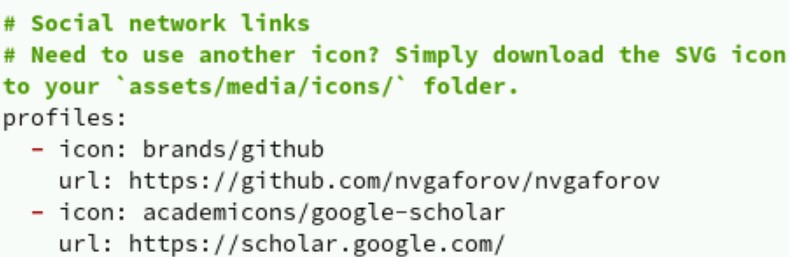
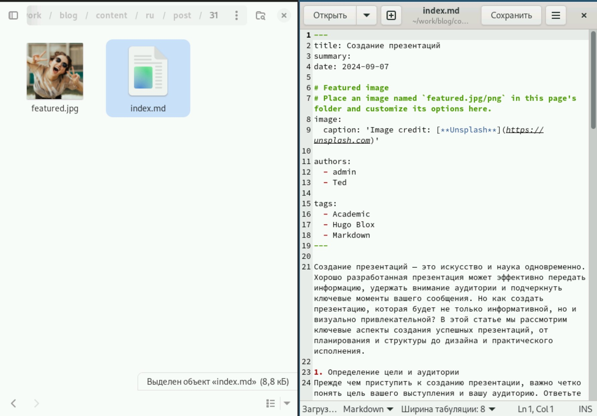
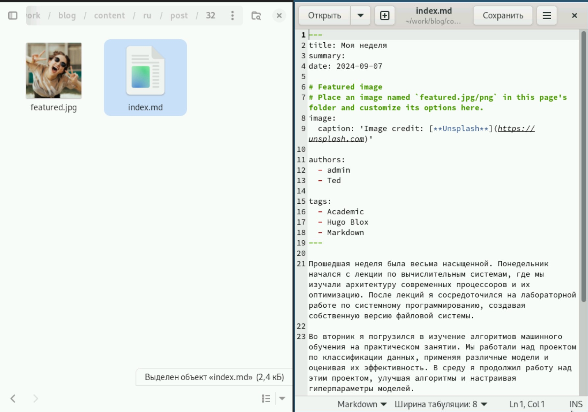

---
## Front matter
lang: ru-RU
title: Индивидуальный проект
subtitle: Этап 4
author:
  - Гафоров Н. В.
institute:
  - Российский университет дружбы народов, Москва, Россия
date: 01 января 1970

## i18n babel
babel-lang: russian
babel-otherlangs: english

## Formatting pdf
toc: false
toc-title: Содержание
slide_level: 2
aspectratio: 169
section-titles: true
theme: metropolis
header-includes:
 - \metroset{progressbar=frametitle,sectionpage=progressbar,numbering=fraction}
 - '\makeatletter'
 - '\beamer@ignorenonframefalse'
 - '\makeatother'

## Fonts
mainfont: PT Serif
romanfont: PT Serif
sansfont: PT Sans
monofont: PT Mono
mainfontoptions: Ligatures=TeX
romanfontoptions: Ligatures=TeX
sansfontoptions: Ligatures=TeX,Scale=MatchLowercase
monofontoptions: Scale=MatchLowercase,Scale=0.9
---

# Информация

## Докладчик

:::::::::::::: {.columns align=center}
::: {.column width="70%"}

  * Гафоров Нурмухаммад Вомикович
  * Студент
  * Российский университет дружбы народов

:::
::: {.column width="30%"}

:::
::::::::::::::

## Цель работы

Сделать сайт на конструкторе Hugo

## Задачи

Зарегистрироваться на соответствующих ресурсах и разместить на них ссылки на сайте  
Сделать пост по прошедшей неделе.  
Добавить пост на тему по выбору  

## Контакты

Напишем на сайте свои контакты на ресурсах

{height=40%}

## Пост о презентация

Напишем пост о создании презентаций

{height=40%}

## Пост о прошедшей неделе

Теперь напишем пост о прошедшей неделе

{height=40%}

## Выводы

В результате работы были написаны посты, а также добавлены ссылки на ресурсы
