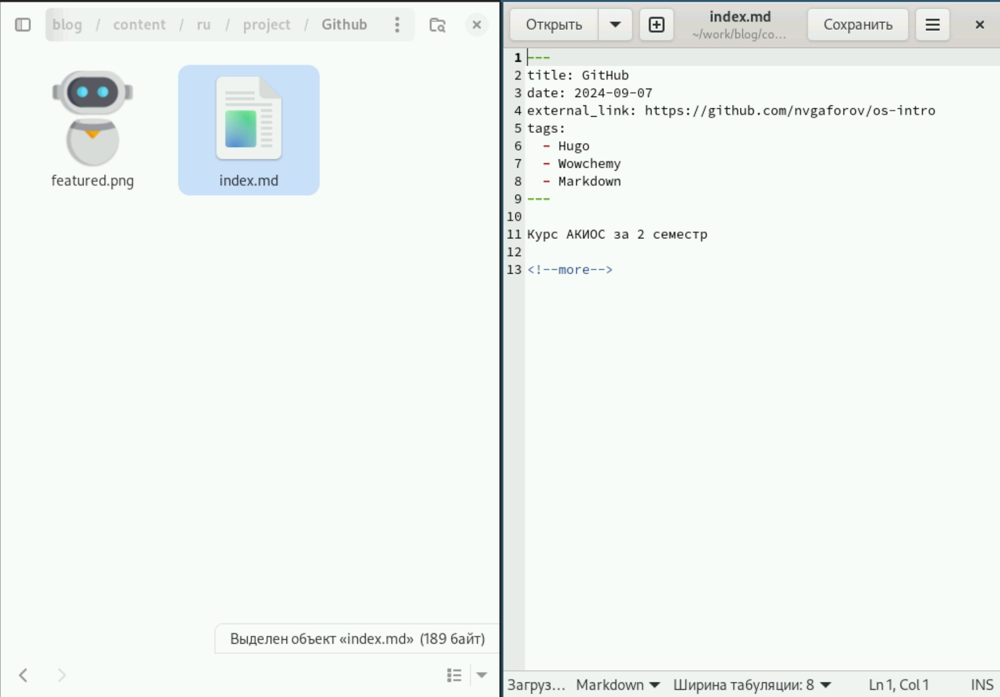
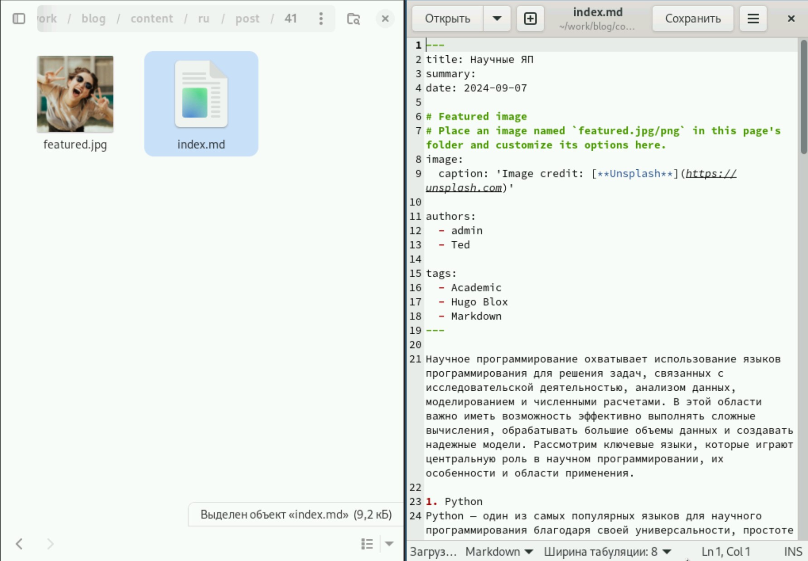
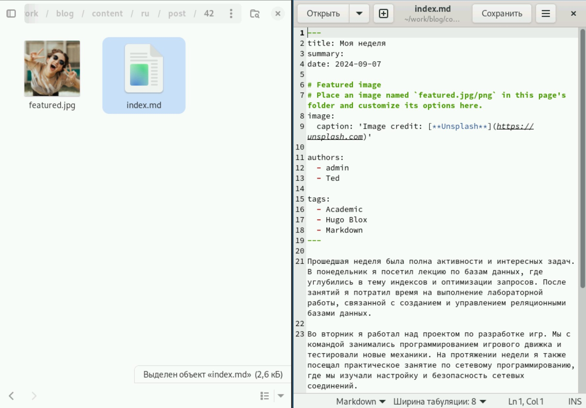
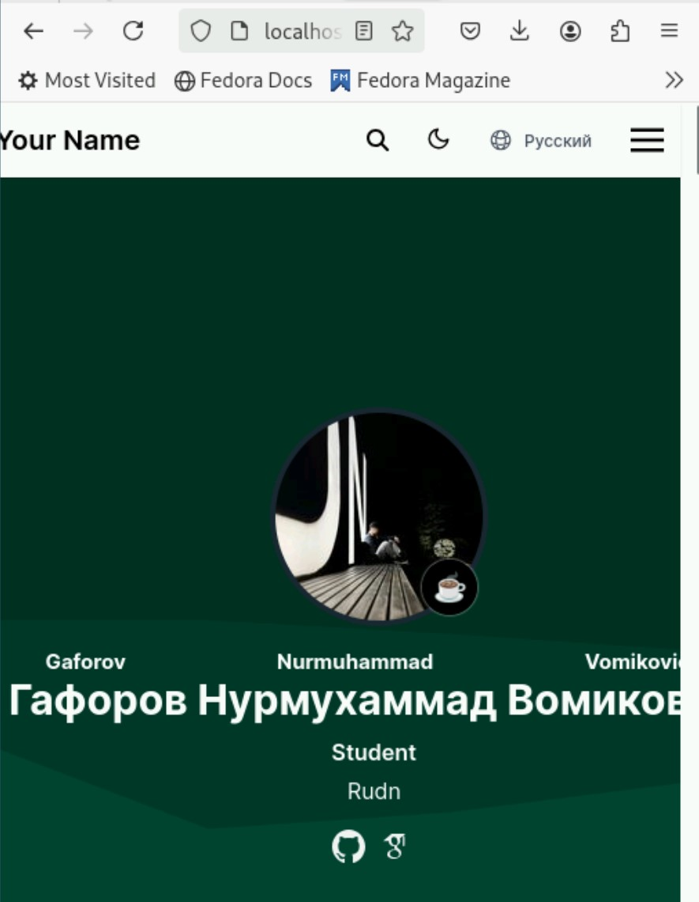

---
## Front matter
lang: ru-RU
title: Индивидуальный проект
subtitle: Этап 5
author:
  - Гафоров Н. В.
institute:
  - Российский университет дружбы народов, Москва, Россия
date: 01 января 1970

## i18n babel
babel-lang: russian
babel-otherlangs: english

## Formatting pdf
toc: false
toc-title: Содержание
slide_level: 2
aspectratio: 169
section-titles: true
theme: metropolis
header-includes:
 - \metroset{progressbar=frametitle,sectionpage=progressbar,numbering=fraction}
 - '\makeatletter'
 - '\beamer@ignorenonframefalse'
 - '\makeatother'

## Fonts
mainfont: PT Serif
romanfont: PT Serif
sansfont: PT Sans
monofont: PT Mono
mainfontoptions: Ligatures=TeX
romanfontoptions: Ligatures=TeX
sansfontoptions: Ligatures=TeX,Scale=MatchLowercase
monofontoptions: Scale=MatchLowercase,Scale=0.9
---

# Информация

## Докладчик

:::::::::::::: {.columns align=center}
::: {.column width="70%"}

  * Гафоров Нурмухаммад Вомикович
  * Студент
  * Российский университет дружбы народов

:::
::: {.column width="30%"}

:::
::::::::::::::

## Цель работы

Сделать сайт на конструкторе Hugo

## Задачи

Сделать записи для персональных проектов.  
Сделать пост по прошедшей неделе.  
Добавить пост на тему по выбору.  

## Заполнение проекта

Добавим на сайт проект в виде курса, который мы сейчас проходим. Папка project, в ней создаём папку github и заполняем так, как на скриншоте

{height=40%}

## Пост о языках научного программирования

Добавим пост о языках научного программирования

{height=40%}

## Пост о прошлой неделе

И пост по прошлой неделе 

{height=40%}

## Заглавная страница сайта

Теперь так будет выглядеть заглавная страница сайта 

{height=40%}

## Выводы

Был добавлен проект на сайт. а также написано 2 поста
