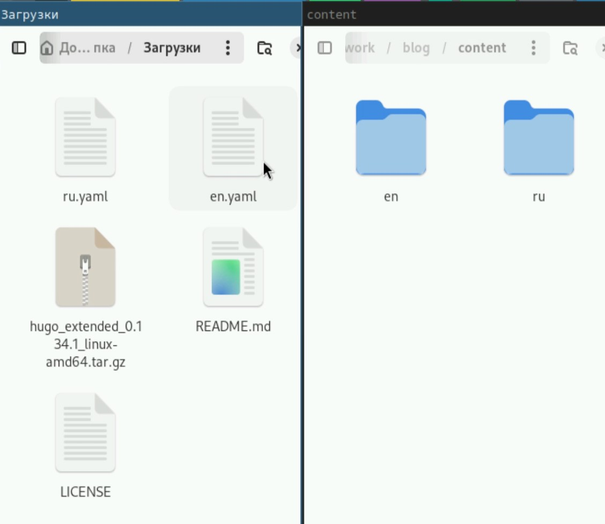
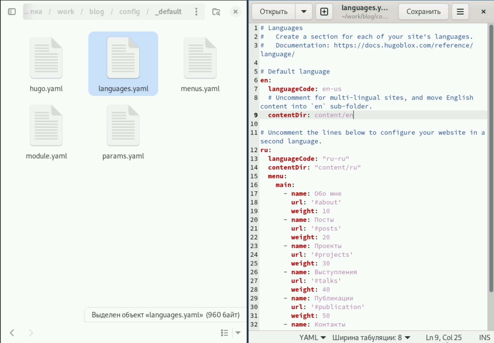
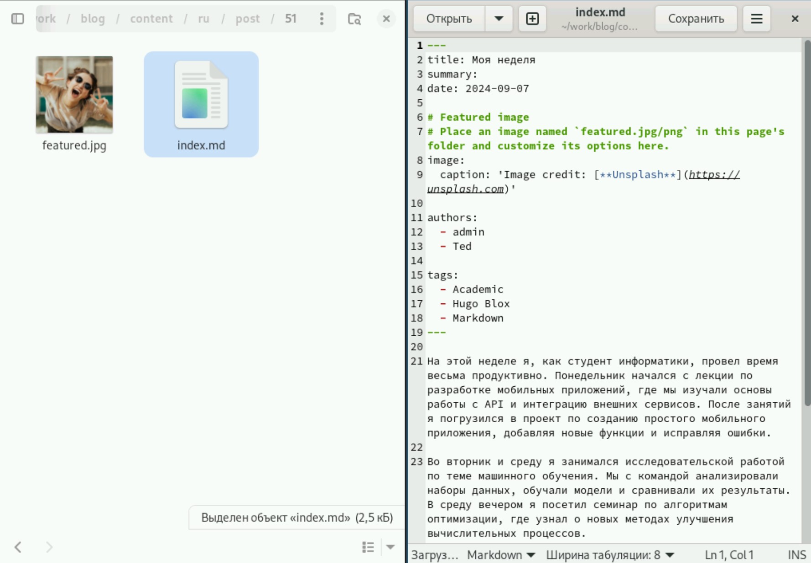
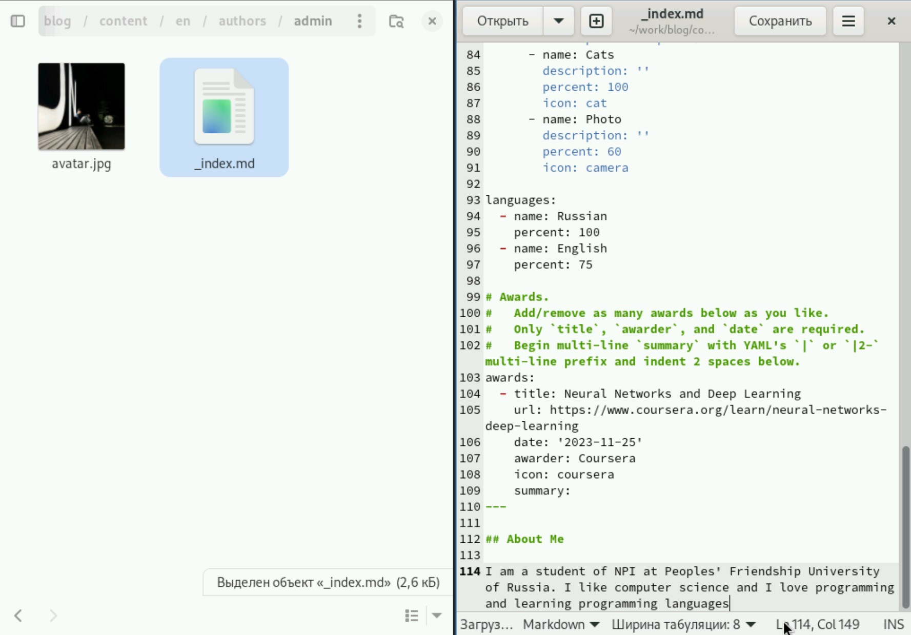
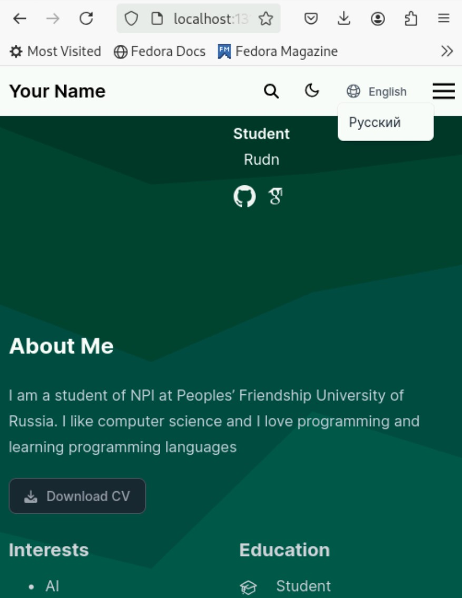

---
## Front matter
lang: ru-RU
title: Индивидуальный проект
subtitle: Этап 6
author:
  - Гафоров Н. В.
institute:
  - Российский университет дружбы народов, Москва, Россия
date: 01 января 1970

## i18n babel
babel-lang: russian
babel-otherlangs: english

## Formatting pdf
toc: false
toc-title: Содержание
slide_level: 2
aspectratio: 169
section-titles: true
theme: metropolis
header-includes:
 - \metroset{progressbar=frametitle,sectionpage=progressbar,numbering=fraction}
 - '\makeatletter'
 - '\beamer@ignorenonframefalse'
 - '\makeatother'

## Fonts
mainfont: PT Serif
romanfont: PT Serif
sansfont: PT Sans
monofont: PT Mono
mainfontoptions: Ligatures=TeX
romanfontoptions: Ligatures=TeX
sansfontoptions: Ligatures=TeX,Scale=MatchLowercase
monofontoptions: Scale=MatchLowercase,Scale=0.9
---

# Информация

## Докладчик

:::::::::::::: {.columns align=center}
::: {.column width="70%"}

  * Гафоров Нурмухаммад Вомикович
  * Студент
  * Российский университет дружбы народов

:::
::: {.column width="30%"}

:::
::::::::::::::

## Цель работы

Сделать сайт на конструкторе Hugo

## Задачи

Сделать поддержку английского и русского языков.  
Разместить элементы сайта на обоих языках.  
Разместить контент на обоих языках.  
Сделать пост по прошедшей неделе.  
Добавить пост на тему по выбору (на двух языках).  

## Настройка мультиязычности

Добавим мультиязычность сайту. Для этого мы в папке content создадим папки ru и en, куда скопируем содержимое этой папки. С гитхаба разработчика также скачаем файлы локализации (ru.yaml и en.yaml) и перенесём их в соотвестсвующие папки 

{height=40%}

## Изменение файла languages.yaml

В папке config/_default изменим файл languages.yaml следующим образом 

{height=40%}

## Пост о неделе

Напишем пост о том, как провели неделю 

{height=40%}

## Редактирование индекса

И изменим в папке en наш индекс файл, переведя всё наше описание на английский язык

{height=40%}

## Внешний вид мультиязычного сайта

Теперь так выглядит наш сайт. Можно переключать язык

{height=40%}

## Выводы

В результате работы был создан полноценный мультиязычный сайт
