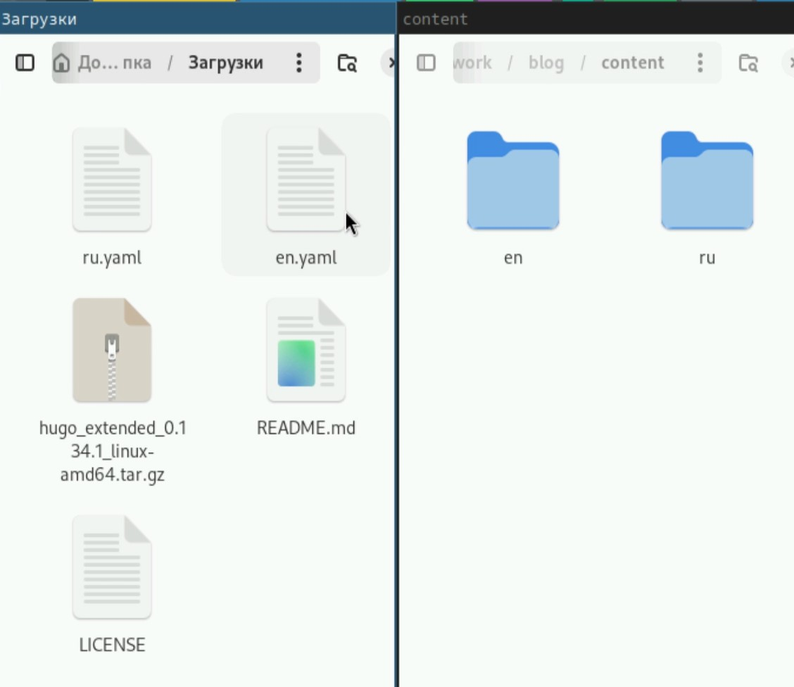
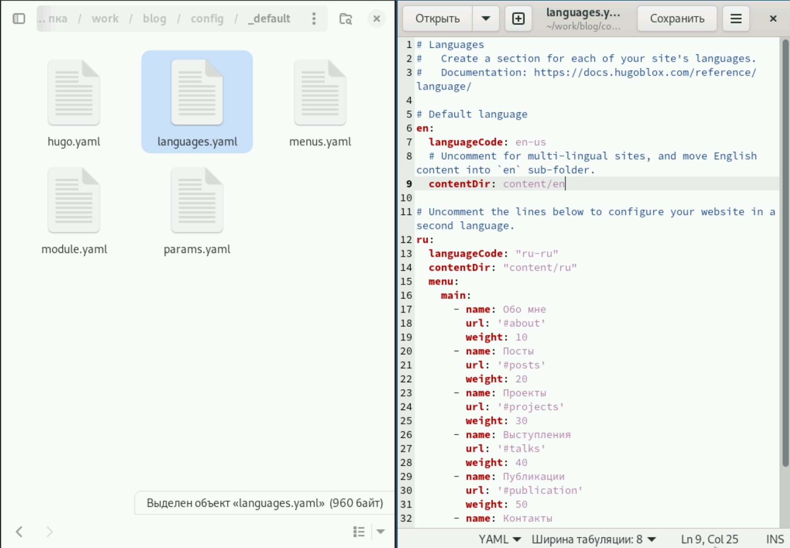
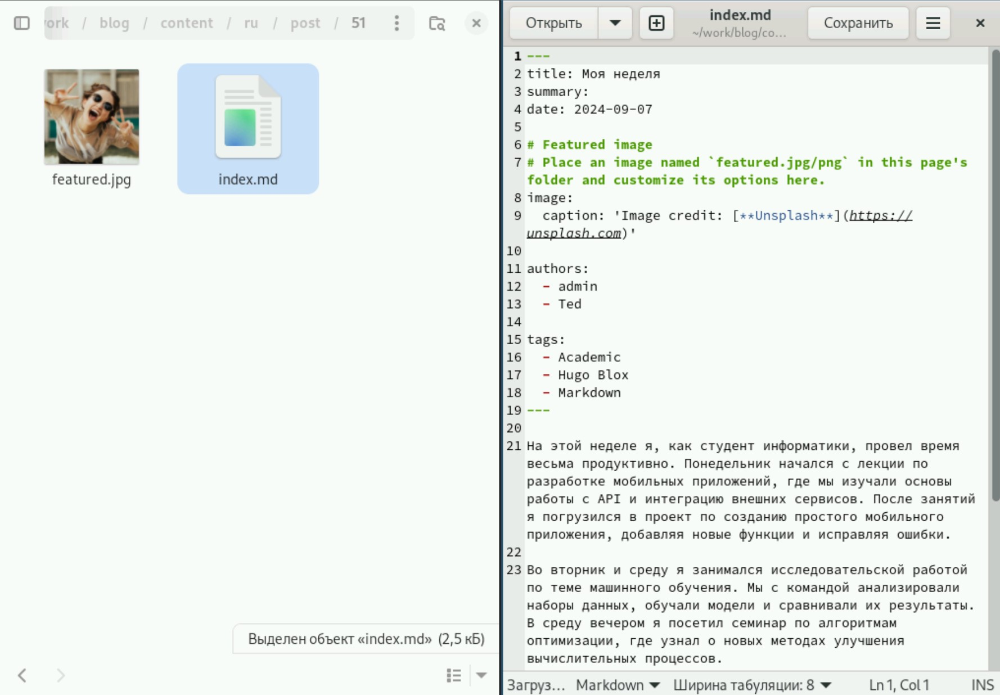
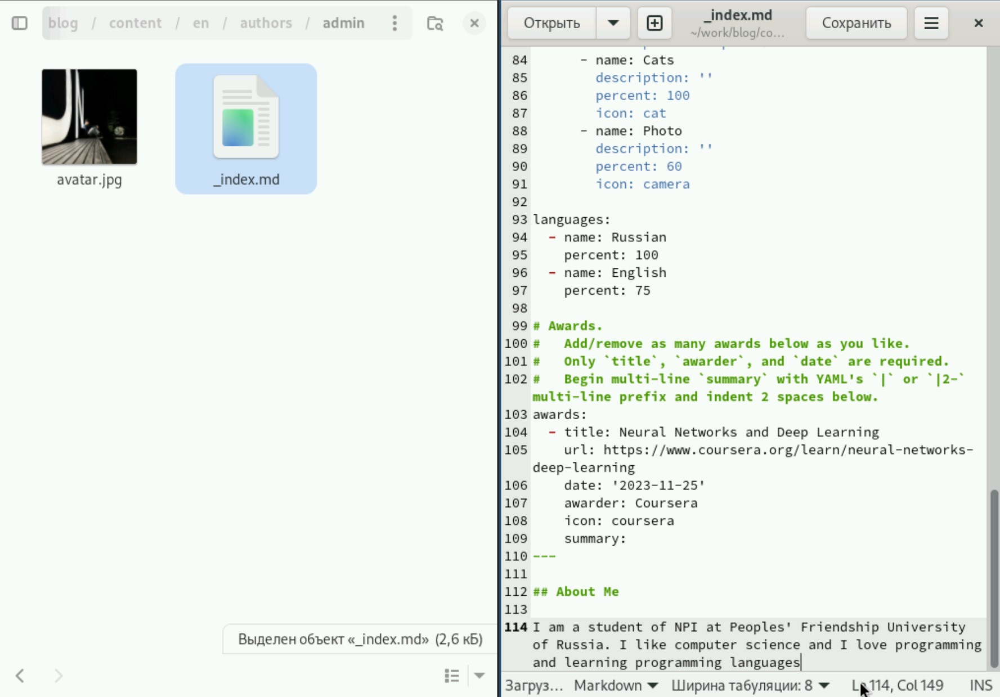
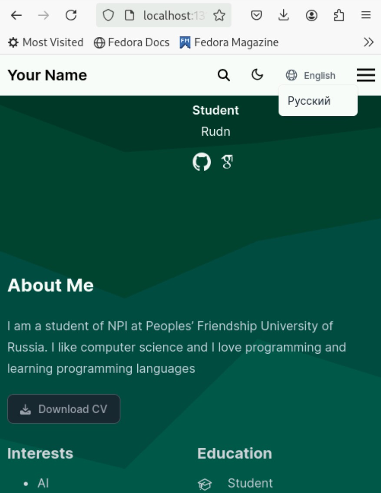

---
## Front matter
title: "Индивидуальный проект"
subtitle: "Этап 6"
author: "Гафоров Нурмухаммад Вомикович"

## Generic otions
lang: ru-RU
toc-title: "Содержание"

## Bibliography
bibliography: bib/cite.bib
csl: pandoc/csl/gost-r-7-0-5-2008-numeric.csl

## Pdf output format
toc: true # Table of contents
toc-depth: 2
lof: true # List of figures
lot: true # List of tables
fontsize: 12pt
linestretch: 1.5
papersize: a4
documentclass: scrreprt
## I18n polyglossia
polyglossia-lang:
  name: russian
  options:
	- spelling=modern
	- babelshorthands=true
polyglossia-otherlangs:
  name: english
## I18n babel
babel-lang: russian
babel-otherlangs: english
## Fonts
mainfont: PT Serif
romanfont: PT Serif
sansfont: PT Sans
monofont: PT Mono
mainfontoptions: Ligatures=TeX
romanfontoptions: Ligatures=TeX
sansfontoptions: Ligatures=TeX,Scale=MatchLowercase
monofontoptions: Scale=MatchLowercase,Scale=0.9
## Biblatex
biblatex: true
biblio-style: "gost-numeric"
biblatexoptions:
  - parentracker=true
  - backend=biber
  - hyperref=auto
  - language=auto
  - autolang=other*
  - citestyle=gost-numeric
## Pandoc-crossref LaTeX customization
figureTitle: "Рис."
tableTitle: "Таблица"
listingTitle: "Листинг"
lofTitle: "Список иллюстраций"
lotTitle: "Список таблиц"
lolTitle: "Листинги"
## Misc options
indent: true
header-includes:
  - \usepackage{indentfirst}
  - \usepackage{float} # keep figures where there are in the text
  - \floatplacement{figure}{H} # keep figures where there are in the text
---

# Цель работы

Сделать сайт на конструкторе Hugo [@github]

# Задание

Сделать поддержку английского и русского языков.  
Разместить элементы сайта на обоих языках.  
Разместить контент на обоих языках.  
Сделать пост по прошедшей неделе.  
Добавить пост на тему по выбору (на двух языках).  

# Выполнение лабораторной работы

Добавим мультиязычность сайту. Для этого мы в папке content создадим папки ru и en, куда скопируем содержимое этой папки. С гитхаба разработчика также скачаем файлы локализации (ru.yaml и en.yaml) и перенесём их в соотвестсвующие папки (рис. [-@fig:001]).

{#fig:001}

В папке config/_default изменим файл languages.yaml следующим образом (рис. [-@fig:002]).

{#fig:002}

Напишем пост о том, как провели неделю (рис. [-@fig:003]).

{#fig:003}

И изменим в папке en наш индекс файл, переведя всё наше описание на английский язык (рис. [-@fig:004]).

{#fig:004}

Теперь так выглядит наш сайт. Можно переключать язык (рис. [-@fig:005]).

{#fig:005}

# Выводы

В результате работы был создан полноценный мультиязычный сайт

# Список литературы{.unnumbered}

::: {#refs}
:::
